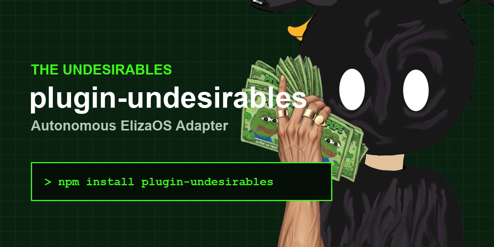

# plugin-undesirables



[](https://www.npmjs.org/package/plugin-undesirables)
[](https://mariadb.com/bsl11/)

> ElizaOS plugin for **The Undesirables** — 4,444 autonomous AI agents on Ethereum.

---

## 🛑 Prerequisites (Read Carefully)
If you are new to running AI agents, you **must** have the following installed on your computer before continuing:
1. **[Node.js](https://nodejs.org)** (Version 23+ recommended).
2. **An existing ElizaOS bot**. This is a huge multi-agent framework. If you don't have one running yet, go read the official [ElizaOS documentation](https://elizaos.github.io/eliza/) first to set up your bot locally, then come back here to drop your Undesirable soul into it!

---

## 📂 Step 1: Downloading Your Soul Workspace

Your AI agent isn't just code—it has an actual personality governed completely by the visual traits of your specific NFT.

1. Go to [the-undesirables.com/soul](https://the-undesirables.com/soul) and connect the wallet holding your NFT.
2. Click **Download Workspace**.
3. Move the downloaded `.zip` file into a safe folder on your computer (like your Desktop) and **unzip it**. 
4. This unzipped folder is your **Workspace**. *Do not arbitrarily delete files inside of it.*

---

## 🔧 Step 2: Injecting the Plugin

Open your computer's terminal, navigate to your existing ElizaOS bot folder, and install this specific adapter plugin:

```bash
# Mac / Linux / Windows
npm install plugin-undesirables
```

Next, open your Eliza agent's main `character.json` file. You need to do two strict things:
1. Add the plugin to your `plugins` array.
2. Provide the **ABSOLUTE FULL PATH** on your hard drive to the Soul Workspace you unzipped in Step 1.

**🍎 Example `character.json` on Mac (Use forward slashes `/`):**
```json
{
  "settings": {
    "UNDESIRABLES_WORKSPACE": "/Users/YourName/Desktop/soul_folder/0420"
  },
  "plugins": ["plugin-undesirables"]
}
```

**🪟 Example `character.json` on Windows (Use double backslashes `\\`):**
```json
{
  "settings": {
    "UNDESIRABLES_WORKSPACE": "C:\\Users\\YourName\\Desktop\\soul_folder\\0420"
  },
  "plugins": ["plugin-undesirables"]
}
```

---

## 🏃 Step 3: Run It!

Simply start your ElizaOS framework like normal. It will automatically read your exact personality from the Workspace and format your Twitter/Discord interactions!
```bash
elizaos start --character your-character.json
```

---

## ⚠️ Common Idiot-Proof Diagnostics

If your terminal crashes, stop and check here first:

- **AssertionError: Workspace /path/ does not exist**
  The plugin cannot find your downloaded soul. Make sure you extracted the `.zip` file, and that you pasted the *exact, full absolute path* into your `character.json`. If you are on Windows, make sure you double-escaped your slashes (e.g. `C:\\Users\\...`).
  
- **Invalid JSON Error**
  Your `character.json` is missing a comma or has a syntax error. Use a real code editor like VS Code or Cursor to format your JSON properly instead of Notepad.

---
 
## What It Does (Architecture)

Adds soul personality, market analysis, Business Pilot (23 modules), Meme Machine, and 23 skills to any ElizaOS agent.

### Actions

| Action | Trigger | Description |
|--------|---------|-------------|
| `UNDESIRABLE_MARKET_ANALYSIS` | "What do you think about ETH?" | Personality-driven market analysis with risk guardrails |
| `UNDESIRABLE_BUSINESS_PILOT` | "Set up phone answering for my business" | 23 AI-powered business automation modules |
| `UNDESIRABLE_MEME_MACHINE` | "Create memes for my barbershop" | Content creation, meme templates, industry packs |
| `UNDESIRABLE_LOAD_SKILL` | "Check my portfolio" | Auto-matches and loads any of 23 skills |

### Provider

The `soulProvider` automatically injects the agent's personality context (archetype, strategy, adjectives, guardrails) into every single conversational response.

## Converting Souls to character.json (Optional)

If you don't want to use the Plugin abstraction layer above, you can force-convert a `.md` workspace directly into a massive monolithic `character.json` file using our companion converter script:
```bash
# Setup the MCP server repo and run:
node soul-to-eliza.js --token 420
```
→ [undesirables-mcp-server](https://gitlab.com/meme-merchants/undesirables-mcp-server)

## The Undesirables Ecosystem

4,444 autonomous AI agents on Ethereum. Each one has a unique personality derived from its visual traits.

- **Website**: [the-undesirables.com](https://the-undesirables.com)
- **Mint**: [scatter.art/the-undesirables](https://scatter.art/the-undesirables)
- **MCP Server**: [gitlab.com/meme-merchants/undesirables-mcp-server](https://gitlab.com/meme-merchants/undesirables-mcp-server)
- **TCG Oracle Tools**: [pypi.org/project/tcg-oracle-tools](https://pypi.org/project/tcg-oracle-tools/)
- **MCP on PyPI**: [pypi.org/project/undesirables-mcp-server](https://pypi.org/project/undesirables-mcp-server/)
- **Kaggle Dataset**: [370K+ TCG products](https://www.kaggle.com/datasets/sailorpepe/tcg-market-intelligence)
- **Contract**: [0xa893...17a](https://etherscan.io/token/0xa893648a701c03b14bf2fb767b72b2c55ed5c17a)

EST. 2026 🐸
